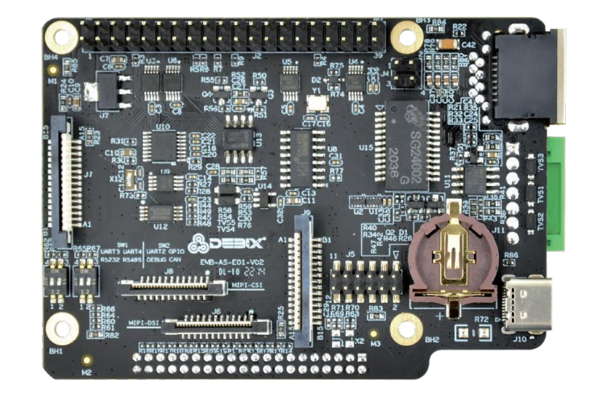
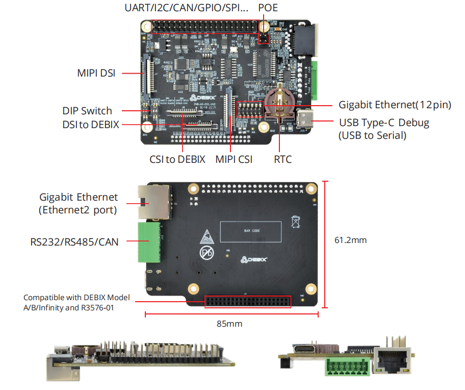
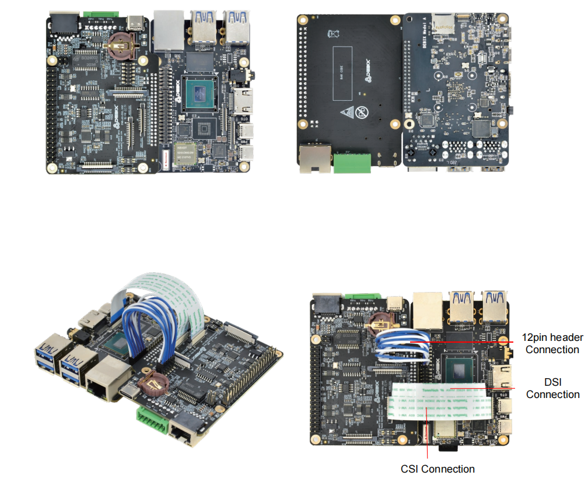

# DEBIX I/O Board
 

## Overview
DEBIX I/O Board is an add-on board designed for DEBIX Model A, DEBIX Model B and is compatible with DEBIX Infinity and DEBIX R Series R3576-01. It adds one RJ45 Gigabit Ethernet interface and PoE capability to your Single Board Computer. It comes
with RS232, RS485 and CAN Transceiver to allow connection with more industrial equipment, and its strong expansion ability brings unlimited possibilities.

## Compatibility:
Compatible with DEBIX Model A, DEBIX Model B, DEBIX Infinity, DEBIX R3576-01

## Specification
| I/O Interfaces    |       |
|-------------------|------------------|
| Gigabit Ethernet  | 1x Gigabit Ethernet port POE Supported (Compatible with POE power device module) |
| USB               | 1 x USB Type-C Debug (USB to Serial) |
| RTC               | 1 x RTC          |
| Serial Ports      | 1 x RS232 1 x RS485 |
| CAN               | 1 x CAN Transceiver |
| DIP Switch        | 2 x 2bit DIP Switch (used for selecting USB-Debug, RS232, RS485 and CAN) |
| **Expansion**     |
| 40-Pin Double-Row Headers  |3 x UART, 2 x I2C, 2 x SPI, 2 x CAN, 6 x GPIO for default, can be reused as I2S, PWM, SPDIF and GPIO through software configuration.|
| MIPI CSI          | 1 x MIPI CSI     |
| MIPI DSI          | 1 x MIPI DSI     |
| EEPROM            | 1 x 2Kbit EEPROM |
| **Accessories**   |
| Cables            | 2 x Flexible flat cable for DSI & CSI 1 x Female to female jumper wire for Ethernet |
| **Power Supply**  |
| Power Input       | DC 5V/500mA      |
| **Mechanical**    |
| Size (LxW)        | 85.0mm x 61.2mm (±0.5mm) |
| Gross Weight      | 62g (±0.5g)      |
| Net Weight        | 31g (±0.5g)      |

 

## Product Compliance and Safety
CE (CE-EMC) | FCC | RoHS | UKCA | C-Tick  
*For more information, please visit [our offical website.](https://debix.io/product/debix-4g-board/)*

## I/O Interfaces:

## Connection with DEBIX Model A/B:

## Safety Instructions and Warnings:
**General:**
- Avoid exposure to water, moisture and conductive surfaces while operating.
- Handle with care to avoid mechanical or electrical damage to the circuit board and connectors.
- Only handle the board by the edges when powered on to minimize the risk of electrostatic discharge damage.

**Environment:**
- Operate in a well-ventilated environment, even if using a case.
- Place on a stable, flat, non-conductive surface and avoid contact with conductive items.

**Connections:**
- Only connect compatible devices to the GPIO ports to avoid damage and warranty voiding.
- Use peripherals that comply with relevant standards for the country of use and ensure proper insulation and operation.

**Additional notes:**
- This summary is not exhaustive, please refer to the full User Manual for details.
- If you are unsure about any aspect of safety or operation, consult a qualified professional.

## Contact Us
- **Headquarters**: DEBIX Technology Inc., 8345 Gold River Ct., Las Vegas, NV 89113, USA  
- **Factory**: 5-6/F., East Zone, Shunheda A2 Building, Liqxiandong Industrial Park, XiLi, Nanshan Dist., Shenzhen, China  
- **Email**: info@debix.io  
- **Website**: [www.debix.io](https://www.debix.io)  
- **Community**: [Discord](https://discord.com/invite/adaHHaDkH2)